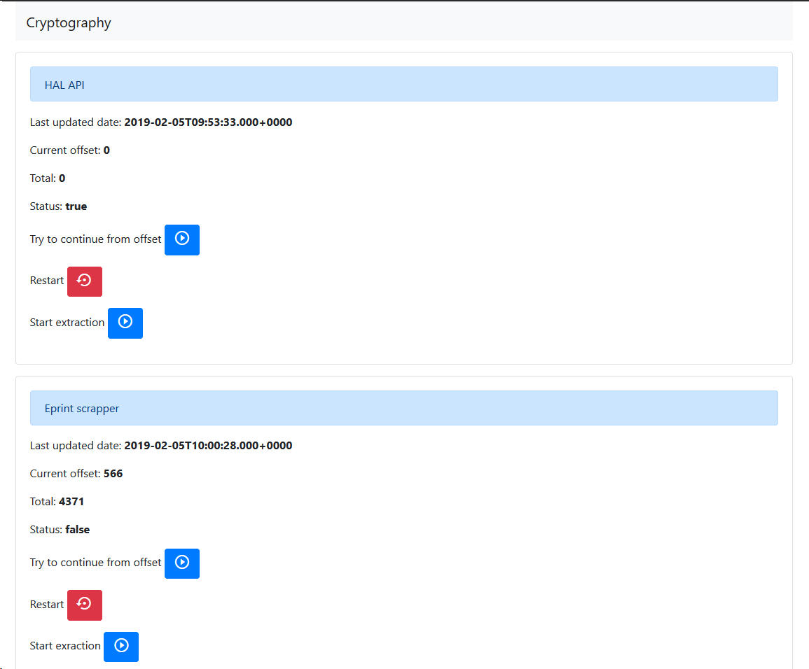
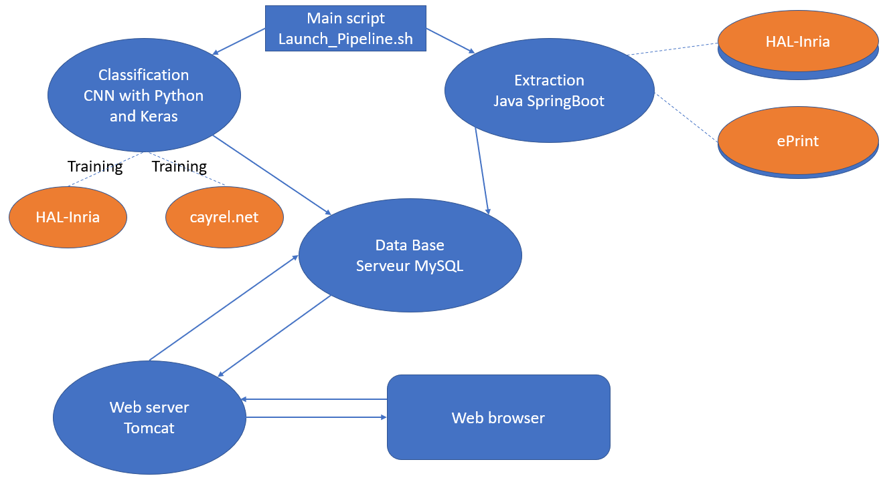

# PRI-base-articles-crypto 2021/2022
## Présentation du projet
Nous sommes la troisième équipe à travailler sur ce sujet. Notre travail s'est appuyé sur l'application réalisée par le premier groupe qui a travaillé sur ce sujet que nous avons fiabilisé et dont nous avons étendu les fonctionnalités. Leur travail peut être consulté sur [leur github](https://github.com/RaphaelChevasson/PRI-base-articles-crypto).

Equipe étudiante: Amine BOUZID, Ruben FELICIANO, Jinda WU  
Client: Pierre-Louis CAYREL  
Tuteur: Christophe GRAVIER  

## Notre travail
Les fonctionnalités que nous avons ajoutées au produit sont les suivantes :  
* La connexion entre les boutons de l'interface et l'API du côté serveur (qui n'avait pas été fait avant, sans doute par manque de temps).  
* L'ajout de nouvelles sources pour rechercher des publications. Pour cela, nous utilisons l'[API](https://www.semanticscholar.org/product/api) de [Semantic Scholar](https://www.semanticscholar.org/), un site regroupant les publications scientifiques provenant de pluiseurs sources, telles que ArXiv, IEEE ou IACR EPrint. Cela nous permet d'obtenir une plus grande variété d'articles avec une recherche.  
* L'ajout de **mots clés** qui sont utilisés lors des requêtes de recherche d'article afin d'en affiner le résultat. Cela nous a permit de régler le principal problème qui nous a été remonté par rapport à l'application précédente, qui était le manque de précision des résultats (on récupérait tous les articles du site d'[Hal Inria](https://hal.inria.fr/), peut importait leur sujet).  
* La mise en place d'un fichier de configuration (appelé *keywords.txt* présent dans */server/src/main/ressources*) qui permet à un utilisateur de lister des mots clés pertinents sur lesquelle il veut faire une recherche. Une recherche peut contenir plusieurs mots clés séparés pas un **+**. Pour recherche une expression exacte, il faudra entourer cette expression avec des **""**. Il est également possible d'avoir une liste de keywords (et de faire autant de recherches) en les séparant par une **virgule** et un **saut de ligne**.  
* La possibilité d'exporter les articles présents dans notre base de données au format **Bibtex** depuis l'interface de l'application.

# Tutoriel d'installation

## EITHER from binaries

- Install a MySQL server (we suggest [MySQL Workbench](https://dev.mysql.com/downloads/workbench/)) : You have to run your database server before running the application so you can connect it to the database.
- Download the project folder from [here](https://drive.google.com/drive/folders/15UIyvpS-Parsxls8j62edEfAjuADWNxr?usp=sharing)
- Follow the setup steps in [the classification readme](Classification/readme.md)
- Open a Cmd or a Terminal, cd into the folder and run : `java -jar server.jar` to launch the services

## OR from source

Clone this repository:

```
git clone https://github.com/RaphaelChevasson/PRI-base-articles-crypto.git
```

### BackEnd :

First, you need to install a MySQL server (we suggest [MySQL Workbench](https://dev.mysql.com/downloads/workbench/)) : You have to run your database server before running the application so you can connect it to the database.

Then, all you have to do is to open the maven project named as server on your IDE and run ServerApplication.java as a springboot application.

Finally on your browser go to : http://localhost:8080/

### FrontEnd :

in the front folder, open a Cmd and install dependencies :
```
npm install
```
and the you start the Angular devserver :
```
npm start
```
Finally on your browser go to : http://localhost:4200/

### Setup Extraction

You have to go to : http://localhost:4200/admin
Then to start the extraction from the source that you want, you click on the start extraction button like in the picture down bellow :

If you want to see the total number of the extracted posts, you will have to refresh the page.
then to see all the posts extracted you have to go to : http://localhost:4200/posts


### Setup Classification

Follow the setup steps in [the classification readme](Classification/readme.md)

# Usage

## Launch the Extraction-Classification-Storage pipeline

Launch `launch_pipeline.sh` on a terminal. If you are on windows, lauch it using [git bash](https://gitforwindows.org/)

## Browse the list

## Use the administration interface

Go to : http://localhost:4200/admin/edit 
You will have the list of all the posts and you can edit or delete them.

# How it works

Here is a little diagram showing essential bricks of the project, the main technology they use, and how they connect together:



# Inquiries

Feel free to contact us via github!
